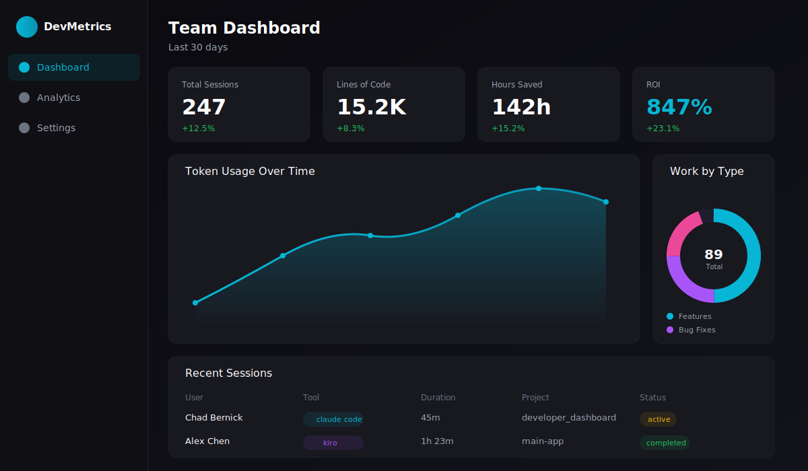
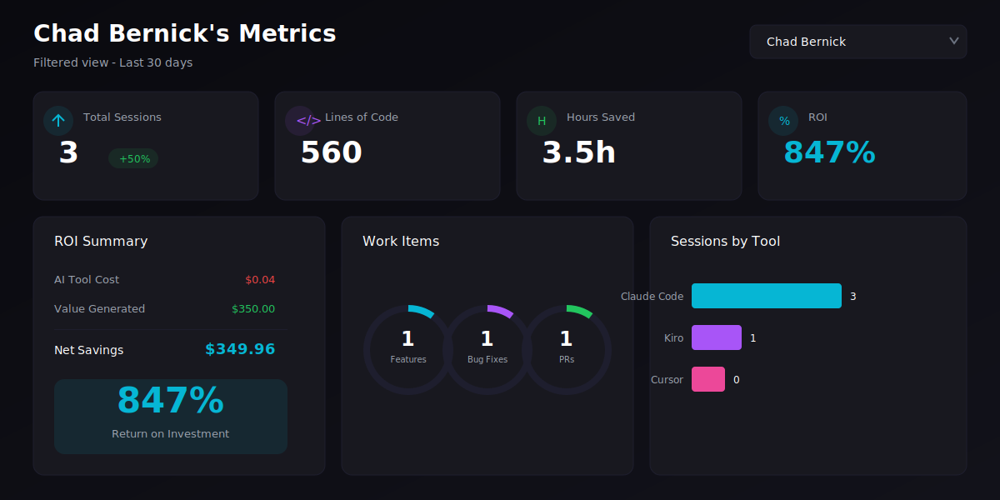

# Developer Metrics Dashboard

A comprehensive dashboard for tracking AI-assisted development productivity, measuring ROI, and monitoring team performance across multiple AI coding tools.



## Features

- **Multi-Tool Support**: Track usage across Claude Code, Kiro, Codex, GitHub Copilot, Cursor, and more
- **OpenTelemetry Integration**: Native OTLP support for Claude Code metrics collection
- **Configurable Widgets**: Customize your dashboard with drag-and-drop widgets via the "+Add Data" modal
- **GitHub Integration**: Automatic commit classification and PR tracking via webhooks
- **Real-Time Metrics**: Sessions, lines of code, tokens used, active time, and costs
- **Dynamic ROI Calculation**: Hours saved calculated from lines of code with configurable productivity multipliers
- **Work Item Tracking**: Automatically classify commits as features, bug fixes, refactors
- **Team Analytics**: Filter by user or view aggregate team metrics
- **Dark Mode**: Beautiful dark theme optimized for developers

## Dashboard Preview

### Main Dashboard


### Integrations Setup


## Quick Start

### Prerequisites

- Node.js 18+
- npm or yarn

### Installation

```bash
# Clone the repository
git clone https://github.com/yourusername/developer_dashboard.git
cd developer_dashboard

# Install dependencies
npm install

# Initialize the database
npm run db:push

# Seed sample data (optional)
npm run db:seed

# Start the development server
npm run dev
```

Open [http://localhost:3000](http://localhost:3000) to view the dashboard.

## Configuration

### Environment Variables

Create a `.env.local` file:

```env
# Database path (optional, defaults to ./data/dashboard.db)
DATABASE_PATH=./data/dashboard.db
```

### Database Commands

```bash
npm run db:generate  # Generate migrations
npm run db:migrate   # Run migrations
npm run db:push      # Push schema to database
npm run db:studio    # Open Drizzle Studio
npm run db:seed      # Seed sample data
```

## Integrations

### GitHub Webhooks

The dashboard can automatically track commits and PRs from your GitHub repositories.

1. Go to **Settings > Integrations > GitHub**
2. Copy the webhook URL: `https://your-domain.com/api/v1/webhooks/github`
3. In your GitHub repo, go to **Settings > Webhooks > Add webhook**
4. Configure:
   - **Payload URL**: Your webhook URL
   - **Content type**: `application/json`
   - **Events**: Push, Pull requests, Pull request reviews

Commits are automatically classified based on conventional commit messages:
- `feat:` or `add:` → Feature
- `fix:` or `bug:` → Bug Fix
- `refactor:` → Refactor
- `docs:` → Documentation
- `test:` → Test
- `chore:` → Chore

### Claude Code (OpenTelemetry)

Track Claude Code sessions, tokens, costs, lines of code, and active time using OpenTelemetry:

1. Add the following to your shell profile (`~/.zshrc` or `~/.bashrc`):

```bash
export CLAUDE_CODE_ENABLE_TELEMETRY=1
export OTEL_METRICS_EXPORTER=otlp
export OTEL_LOGS_EXPORTER=otlp
export OTEL_EXPORTER_OTLP_PROTOCOL=http/json
export OTEL_EXPORTER_OTLP_ENDPOINT=http://localhost:3000/api/v1/otlp
```

2. Restart your terminal or run `source ~/.zshrc`
3. Start using Claude Code - metrics will automatically flow to the dashboard

**Supported Metrics:**
- `claude_code.session.count` - Session tracking
- `claude_code.token.usage` - Input/output token counts
- `claude_code.cost.usage` - Token costs in USD
- `claude_code.lines_of_code.count` - Lines added/modified
- `claude_code.active_time.total` - Active session time
- `claude_code.commit.count` - Git commits
- `claude_code.pull_request.count` - Pull requests created

### Configuring Dashboard Widgets

Click the **"+Add Data"** button in the dashboard header to:
- Enable/disable metrics widgets
- Drag and drop to reorder widgets
- View all available OpenTelemetry metrics

### Other AI Tools

See the Integrations page for setup guides for:
- Kiro
- OpenAI Codex
- GitHub Copilot
- Cursor

## API Reference

### Ingest API

Send metrics to the dashboard:

```bash
POST /api/v1/ingest
Content-Type: application/json
X-API-Key: your-api-key

{
  "event": "session_start" | "session_end" | "token_usage" | "code_change" | "commit" | "pr_activity",
  "data": { ... }
}
```

#### Events

**session_start**
```json
{
  "event": "session_start",
  "data": {
    "tool": "claude_code",
    "model": "claude-3-opus",
    "projectName": "my-project"
  }
}
```

**token_usage**
```json
{
  "event": "token_usage",
  "data": {
    "sessionId": "uuid",
    "inputTokens": 1500,
    "outputTokens": 2500,
    "model": "claude-3-opus"
  }
}
```

**code_change**
```json
{
  "event": "code_change",
  "data": {
    "sessionId": "uuid",
    "linesAdded": 100,
    "linesModified": 25,
    "linesDeleted": 10,
    "filesChanged": 5,
    "language": "TypeScript"
  }
}
```

**commit**
```json
{
  "event": "commit",
  "data": {
    "sha": "abc123",
    "message": "feat: Add new feature",
    "repository": "my-repo",
    "linesAdded": 50,
    "linesDeleted": 10
  }
}
```

### Dashboard API

```bash
GET /api/v1/dashboard?userId=optional-user-id
```

Returns aggregated metrics for the last 30 days.

### GitHub Webhook

```bash
POST /api/v1/webhooks/github
X-GitHub-Event: push | pull_request | pull_request_review
```

### OpenTelemetry (OTLP) API

Receive metrics and logs from OpenTelemetry-compatible exporters:

```bash
POST /api/v1/otlp/v1/metrics
Content-Type: application/json

POST /api/v1/otlp/v1/logs
Content-Type: application/json
```

These endpoints accept standard OTLP JSON format and automatically extract Claude Code metrics.

### Dashboard Metrics API

Manage widget configuration:

```bash
# Get all metrics configuration
GET /api/v1/dashboard-metrics

# Update metric settings (enable/disable, reorder)
PATCH /api/v1/dashboard-metrics
Content-Type: application/json
{
  "metricId": "sessions",
  "updates": { "isEnabled": true, "displayOrder": 0 }
}
```

## Tech Stack

- **Framework**: [Next.js 16](https://nextjs.org/) with App Router
- **Database**: SQLite with [Drizzle ORM](https://orm.drizzle.team/)
- **Styling**: [Tailwind CSS](https://tailwindcss.com/)
- **Charts**: [Recharts](https://recharts.org/)
- **Icons**: [Lucide React](https://lucide.dev/)
- **Validation**: [Zod](https://zod.dev/)

## Project Structure

```
developer_dashboard/
├── src/
│   ├── app/
│   │   ├── api/v1/              # API routes
│   │   │   ├── dashboard/       # Dashboard data
│   │   │   ├── dashboard-metrics/ # Widget configuration
│   │   │   ├── ingest/          # Metrics ingestion
│   │   │   ├── otlp/v1/         # OpenTelemetry endpoints
│   │   │   │   ├── metrics/     # OTLP metrics receiver
│   │   │   │   └── logs/        # OTLP logs receiver
│   │   │   ├── webhooks/        # GitHub webhooks
│   │   │   └── ...
│   │   ├── settings/            # Settings pages
│   │   └── page.tsx             # Main dashboard
│   ├── components/
│   │   ├── charts/              # Chart components
│   │   ├── dashboard/           # Dashboard components
│   │   │   ├── widget-grid.tsx  # Drag-and-drop widgets
│   │   │   └── add-data-modal.tsx # Widget configuration modal
│   │   ├── settings/            # Settings components
│   │   └── ui/                  # UI primitives
│   └── lib/
│       ├── db/                  # Database schema & connection
│       ├── otlp/                # OpenTelemetry types & parsing
│       └── utils/               # Utility functions
├── scripts/
│   └── seed.ts                  # Database seeding
├── data/                        # SQLite database files
└── public/assets/               # Static assets
```

## Development

```bash
# Run development server
npm run dev

# Run linting
npm run lint

# Build for production
npm run build

# Start production server
npm start
```

## Contributing

1. Fork the repository
2. Create a feature branch: `git checkout -b feature/my-feature`
3. Commit your changes: `git commit -m 'feat: Add my feature'`
4. Push to the branch: `git push origin feature/my-feature`
5. Open a Pull Request

## License

MIT License - see [LICENSE](LICENSE) for details.

## Acknowledgments

- Built with [Claude Code](https://claude.ai) by Anthropic
- Dashboard design inspired by modern developer tools
