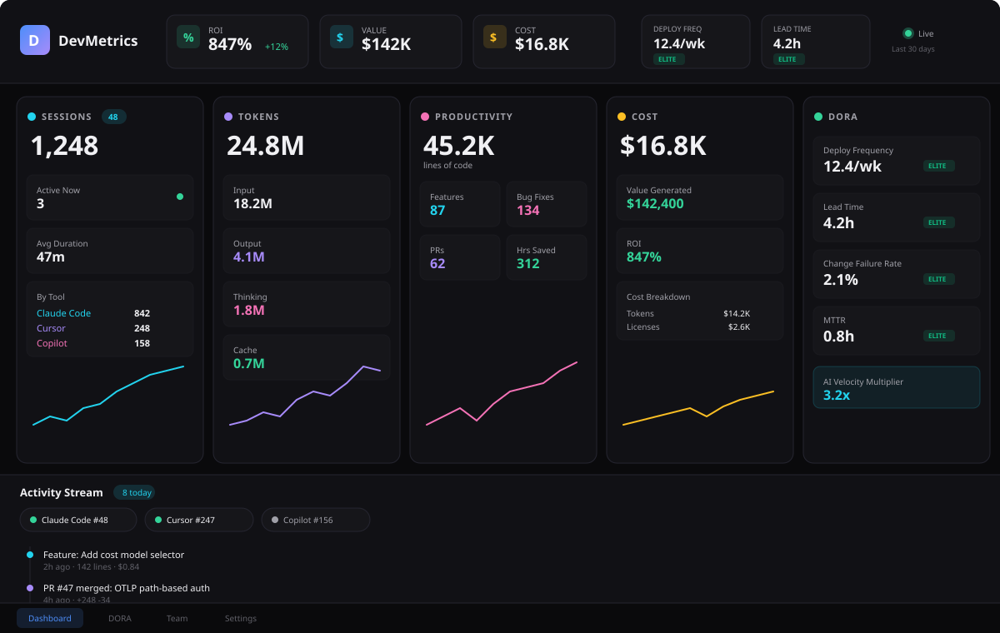
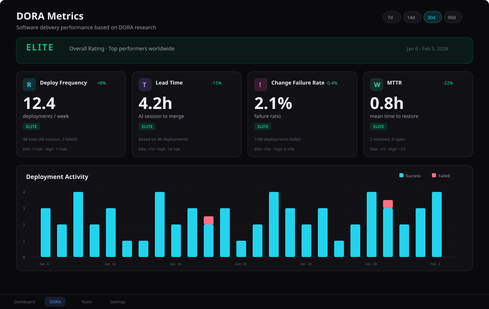
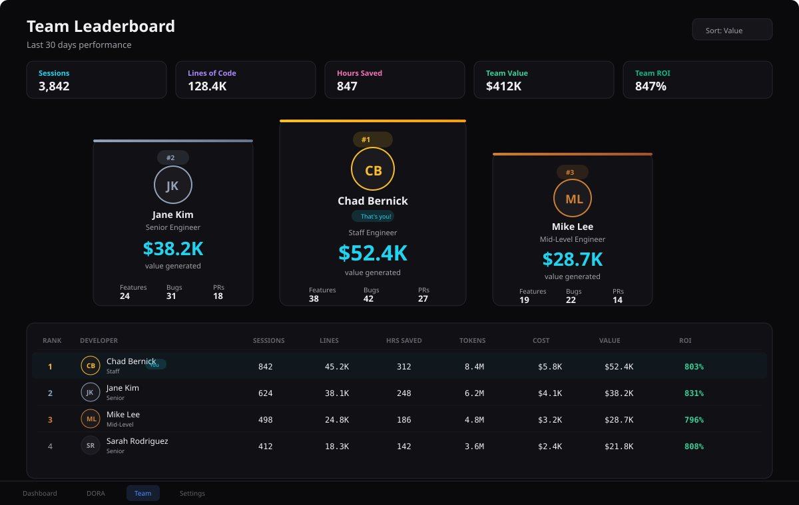
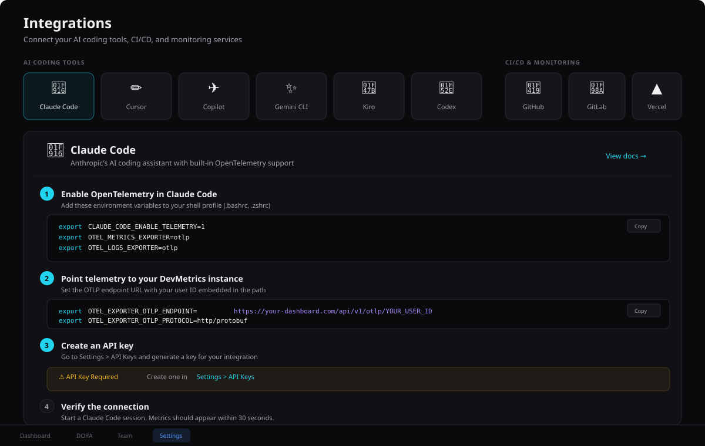

# DevMetrics

**Engineering Intelligence for AI-Assisted Development**

Track productivity, measure ROI, and optimize your team's AI coding tool usage across Claude Code, Cursor, Copilot, Gemini CLI, Kiro, and Codex — all in one dashboard.



## What is DevMetrics?

DevMetrics is a self-hosted engineering intelligence platform that answers the question: *"Is our AI tooling investment actually paying off?"*

It collects telemetry from your AI coding assistants via OpenTelemetry, tracks GitHub/GitLab activity via webhooks, and synthesizes everything into actionable metrics — ROI calculations, DORA performance ratings, team leaderboards, and cost analysis.

### Key Capabilities

- **Multi-tool telemetry** — Unified metrics across Claude Code, Cursor, Copilot, Gemini CLI, Kiro, and Codex
- **ROI & cost tracking** — Blended frontier pricing, per-model pricing, or custom rates. Know exactly what AI is costing and what it's delivering.
- **DORA metrics** — Deploy frequency, lead time, change failure rate, and MTTR with automatic Elite/High/Medium/Low ratings
- **Team leaderboards** — See who's getting the most value from AI tools, with podium rankings and sortable stats
- **Codebase intelligence** — AI saturation analysis, acceptance rates, and code quality metrics per repository
- **Real-time activity stream** — Live session tracking with per-event cost and line-of-code attribution
- **Self-hosted & private** — Your data stays on your infrastructure. SQLite database, zero external dependencies.

## Screenshots

### DORA Metrics
Software delivery performance based on Google's DORA research, with AI impact analysis.



### Team Leaderboard
Podium-style rankings with detailed per-developer breakdowns.



### Integrations
Step-by-step setup guides for every supported tool.



## Tech Stack

| Layer | Technology |
|-------|-----------|
| Framework | Next.js 16 (App Router, React 19) |
| Database | SQLite via Drizzle ORM |
| Telemetry | OpenTelemetry (OTLP HTTP/protobuf + JSON) |
| Styling | Tailwind CSS 4 |
| Charts | Recharts |
| Language | TypeScript 5 |

## Quick Start

### Prerequisites

- Node.js 20+
- npm 10+

### 1. Clone and Install

```bash
git clone https://github.com/chadbernick/DevMetrics.git
cd DevMetrics
npm install
```

### 2. Database Setup

```bash
npm run db:setup
```

This creates the SQLite database, pushes the schema, prompts you to create an admin user, and seeds model pricing configurations.

### 3. Start the Server

```bash
npm run dev
```

Open [http://localhost:3000](http://localhost:3000) and log in with your admin credentials.

## Connecting AI Tools

### Claude Code

Add to your shell profile (`.bashrc`, `.zshrc`):

```bash
export CLAUDE_CODE_ENABLE_TELEMETRY=1
export OTEL_METRICS_EXPORTER=otlp
export OTEL_LOGS_EXPORTER=otlp
export OTEL_EXPORTER_OTLP_PROTOCOL=http/protobuf
export OTEL_EXPORTER_OTLP_ENDPOINT=http://localhost:3000/api/v1/otlp/<YOUR-USER-ID>
```

Replace `<YOUR-USER-ID>` with your user ID from Settings > Profile.

### Gemini CLI

```bash
export GEMINI_TELEMETRY_ENABLED=true
export GEMINI_TELEMETRY_TARGET=local
export GEMINI_TELEMETRY_OTLP_PROTOCOL=http
export GEMINI_TELEMETRY_OTLP_ENDPOINT=http://localhost:3000/api/v1/integrations/gemini?user=<YOUR-USER-ID>
```

### GitHub Webhooks

1. Go to your repository's **Settings > Webhooks > Add webhook**
2. Set payload URL to `https://your-domain.com/api/v1/webhooks/github`
3. Content type: `application/json`
4. Set a secret and add it to `.env.local` as `GITHUB_WEBHOOK_SECRET`
5. Select events: **Pushes** and **Pull requests**

### Other Integrations

| Tool | Endpoint | Protocol |
|------|----------|----------|
| Copilot | `/api/v1/integrations/copilot/sync` | REST API |
| Codex | `/api/v1/integrations/codex/logs` | OTLP protobuf |
| Kiro | `/api/v1/integrations/kiro/ingest` | Manual / JSON |
| Cursor | `/api/v1/integrations/cursor/ingest` | Git hooks |
| GitLab | `/api/v1/webhooks/gitlab` | Webhook |
| Vercel | `/api/v1/webhooks/vercel` | Webhook |
| Sentry | `/api/v1/webhooks/sentry` | Webhook |
| PagerDuty | `/api/v1/webhooks/pagerduty` | Webhook |

See the in-app **Settings > Integrations** page for step-by-step setup guides for each tool.

## Cost Model

DevMetrics supports three cost calculation modes:

| Mode | Description |
|------|-------------|
| **Blended Frontier** (default) | Averages pricing across Claude Sonnet 4, GPT-4o, and Gemini 2.5 Pro. Best for teams using multiple AI tools. |
| **Per-Model Pricing** | Exact pricing for each model via regex pattern matching. Falls back to blended rate for unrecognized models. |
| **Flat-Rate License** | For blanket license agreements (Copilot Enterprise, Cursor Pro, etc.). Coming soon. |

Configure in **Settings > Cost Config**.

### Default Blended Rates (per 1M tokens)

| Token Type | Rate |
|-----------|------|
| Input | $2.25 |
| Output | $11.67 |
| Thinking | $11.67 |
| Cache Write | $2.81 |
| Cache Read | $0.23 |

## Architecture

```
                    ┌─────────────────────────────────────┐
                    │          DevMetrics Dashboard        │
                    │         (Next.js 16 + SQLite)        │
                    └──────────────┬──────────────────────┘
                                   │
              ┌────────────────────┼────────────────────┐
              │                    │                     │
    ┌─────────▼──────┐   ┌────────▼────────┐   ┌───────▼───────┐
    │  OTLP Ingest   │   │   Webhooks      │   │  REST APIs    │
    │  /api/v1/otlp  │   │  /api/v1/       │   │  /api/v1/     │
    │  Claude Code   │   │  webhooks/      │   │  dashboard    │
    │  Gemini CLI    │   │  github         │   │  roi          │
    │  Codex         │   │  gitlab         │   │  team         │
    └───────┬────────┘   │  vercel         │   │  analytics    │
            │            │  sentry         │   └───────┬───────┘
            │            │  pagerduty      │           │
            │            └────────┬────────┘           │
            │                     │                    │
            ▼                     ▼                    ▼
    ┌─────────────────────────────────────────────────────────┐
    │                    SQLite Database                       │
    │  sessions │ tokenUsage │ dailyAggregates │ modelPricing │
    └─────────────────────────────────────────────────────────┘
```

### Data Flow

1. **Telemetry arrives** via OTLP (protobuf/JSON) from AI coding tools
2. **Events are parsed** by integration-specific handlers (Claude, Gemini, Codex, etc.)
3. **Sessions and token usage** are recorded with per-model cost calculations
4. **Daily aggregates** are atomically updated on every event for fast dashboard reads
5. **GitHub/GitLab webhooks** track commits, PRs, and deployments for DORA metrics
6. **Dashboard queries** read pre-computed aggregates for instant rendering

## Production Deployment

### Environment Variables

```bash
# .env.local
DATABASE_PATH=/path/to/your/dashboard.db
NEXT_PUBLIC_BASE_URL=https://your-domain.com
GITHUB_WEBHOOK_SECRET=your-secret-here
```

### Build and Start

```bash
npm run build
npm start
```

### Docker

```dockerfile
FROM node:20-alpine
WORKDIR /app
COPY package*.json ./
RUN npm ci --only=production
COPY . .
RUN npm run build
EXPOSE 3000
CMD ["npm", "start"]
```

## Commands

| Command | Description |
|---------|-------------|
| `npm run dev` | Start development server |
| `npm run build` | Production build |
| `npm start` | Start production server |
| `npm run lint` | ESLint |
| `npm run db:setup` | Initial setup with admin user creation |
| `npm run db:push` | Push schema changes to database |
| `npm run db:seed` | Seed configuration data |
| `npm run db:studio` | Open Drizzle Studio (database GUI) |
| `npm run db:migrate` | Run database migrations |
| `npm run db:backup` | Create a database backup |

## Project Structure

```
src/
├── app/
│   ├── (dashboard)/          # Main dashboard (kanban layout)
│   ├── dora/                 # DORA metrics page
│   ├── team/                 # Team leaderboard
│   ├── codebase/             # Codebase intelligence
│   ├── settings/             # Settings (profile, integrations, cost config, API keys, team)
│   ├── api/v1/
│   │   ├── otlp/            # OTLP telemetry endpoints
│   │   ├── integrations/    # Per-tool integration endpoints
│   │   ├── webhooks/        # GitHub, GitLab, Vercel, Sentry, PagerDuty
│   │   ├── dashboard/       # Dashboard data API
│   │   ├── analytics/       # AI impact analytics
│   │   └── settings/        # Settings APIs (cost mode, etc.)
│   └── login/                # Authentication pages
├── components/
│   ├── dashboard/            # Kanban columns, executive bar, activity stream
│   ├── dora/                 # DORA metric cards and charts
│   ├── team/                 # Leaderboard and podium components
│   ├── settings/             # Settings forms and selectors
│   └── ui/                   # Shared UI primitives (Card, etc.)
├── lib/
│   ├── db/                   # Drizzle schema and connection
│   ├── integrations/         # Per-tool integration handlers
│   │   ├── claude/           # Claude Code parser and handlers
│   │   ├── gemini/           # Gemini CLI handlers
│   │   ├── codex/            # Codex handlers
│   │   ├── copilot/          # Copilot sync
│   │   └── shared/           # OTLP primitives, pricing, auth, daily aggregates
│   ├── roi/                  # ROI calculation engine
│   └── utils/                # Date, format, and other utilities
└── scripts/                  # Database setup and seed scripts
```

## License

MIT
